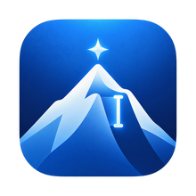
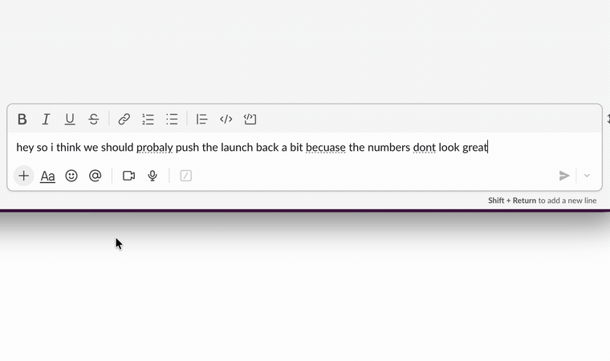
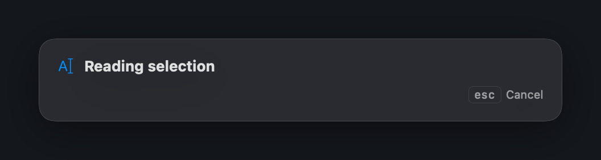
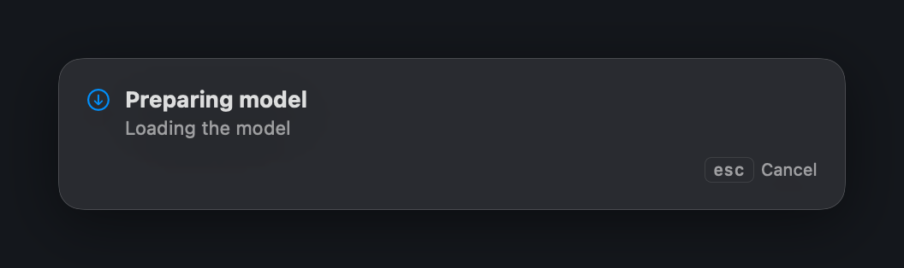
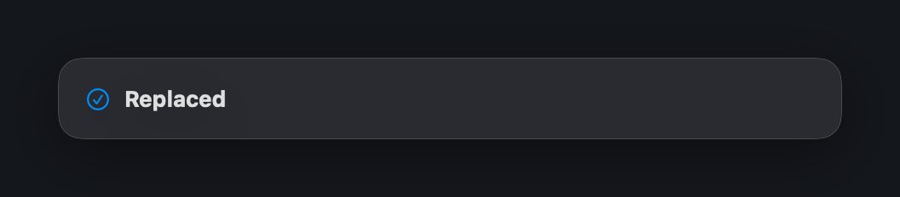

<div align="center">



# Everest

### Fix your writing anywhere on your Mac, with one keystroke.

Select text in any app, press `⌥R`, and a rewrite streams in and replaces it.
**The model runs on your Mac.** No account, no server, no telemetry, and it works on a plane.

<a href="https://github.com/kabrapratik28/Everest/releases/latest/download/Everest.dmg">

</a>

<sub>macOS 26 or later · Apple Silicon · MIT licensed · ~2.3 GB model downloaded on first run</sub>

<br><br>



<sub>Real capture. Sublime Text, which exposes no editable text to Accessibility — Everest verifies the target and pastes.</sub>

</div>

## Why you might want it

- **It is fast to reach.** One keystroke, in the app you are already typing in. No window to switch to, nothing to paste into and back out of.
- **Your text does not leave the machine.** Not "encrypted in transit", not "we do not train on it". It never goes anywhere. Unplug the network and it still works.
- **It replaces the selection.** You are not handed a suggestion to copy; the text in your document changes, and `⌘Z` puts it back.
- **It works where you already write.** Chrome and Safari, Sublime Text and VS Code, Slack, Mail, Messages, Notes, Google Docs, and ordinary macOS text fields. Terminals and PDFs hand you the clipboard instead, and the panel says so rather than failing quietly.
- **Six styles, and they are yours.** Proofread, Professional, Friendly, Concise, Expand, Simplify — every prompt is editable in Settings, and you can add your own.
- **It refuses password fields.** Before reading, and again immediately before any copy.
- **Free and MIT.** No trial, no subscription, no upsell inside the app.

<div align="center">


<br>

</div>

## One honest exception

Some apps do not let macOS hand over a selection at all — terminals, PDFs, Google Docs, Sublime Text — so Everest reads it with a synthetic ⌘C instead. Most of those still get a normal in-place rewrite; see [below](#use) for the two that do not. What they share is that the text passes through the system clipboard on the way, and anything on the system clipboard is eligible for Universal Clipboard if Handoff is on. There is no API to opt out of that. Turn Handoff off in System Settings ▸ General if it matters to you.

[PRIVACY.md](PRIVACY.md) is the full account, including what is stored on disk and how to remove it.

## Install

**[⬇ Download Everest.dmg](https://github.com/kabrapratik28/Everest/releases/latest/download/Everest.dmg)** — or pick a specific build from [Releases](../../releases).

Open the disk image and drag Everest to Applications.

**The first launch needs one extra step.** Everest is signed but not notarised — notarisation requires Apple's $99/year Developer Program, and this app is not earning that yet. So macOS will refuse the first launch and say *"Apple could not verify Everest is free of malware."* Click **Done**, then:

> **System Settings ▸ Privacy & Security**, scroll to Security, and next to *"Everest was blocked to protect your Mac"* click **Open Anyway**.

Since macOS 15 that pane is the only route — the old right-click ▸ Open shortcut no longer works. You do this once; every later launch is normal.

**On a managed or work Mac**, IT policy often removes the Open Anyway button entirely. If it is not there, clear the download flag from Terminal instead:

```bash
xattr -dr com.apple.quarantine /Applications/Everest.app
```

That is not a way around the signature check — the app is signed either way. It removes the "downloaded from the internet" marker, which is the thing that triggers the block.

On first run Everest asks for Accessibility permission (System Settings ▸ Privacy & Security ▸ Accessibility) and then downloads the rewrite model — about 2.3 GB, with a progress bar. **The model is not bundled in the app.**

The weights are [Qwen3-4B-Instruct-2507-4bit](https://huggingface.co/mlx-community/Qwen3-4B-Instruct-2507-4bit) (or [Qwen3-30B-A3B-Instruct-2507-4bit](https://huggingface.co/mlx-community/Qwen3-30B-A3B-Instruct-2507-4bit) if you pick it), pulled from Hugging Face at a pinned revision. They are Apache-2.0 and are **not** covered by Everest's MIT licence. Hugging Face availability and rate limits are outside Everest's control.

## Use

| Key | Does |
|---|---|
| `⌥R` | Quick Improve. One prompt, one rewrite. |
| `⌥⇧R` | Choose Style, then rewrite. |
| `Esc` | Cancel an in-flight rewrite. |

Both shortcuts are configurable in Settings ▸ General.

**Where it replaces in place:** native text fields, browsers, editors, chat apps, and — via a verified paste — apps that expose nothing usable to Accessibility, such as Sublime Text and Google Docs.

**Where it hands you the clipboard instead:** terminals, where a paste goes to the prompt rather than replacing a selection, and PDFs and ordinary web prose, which take no paste at all. The panel stays open and tells you.

**Never:** password and secure fields. Everest refuses before reading, and re-checks immediately before any synthetic copy.

### Why `⌥R`

A global hotkey beats the frontmost app, so the default decides what Everest takes away from every app on your Mac.

- `⌘`+letter is a formatting command somewhere — `⌘I` Italic, `⌘U` Underline, `⌘B` Bold, `⌘K` link.
- `⌃`+letter is worse: Cocoa text views carry emacs bindings and terminals own `⌃C`/`⌃D`/`⌃Z`/`⌃R`.
- `⌥R` costs one character, `®`.

If you rebind, avoid `⌥I`, `⌥E`, `⌥U` and `⌥N` — those are dead keys, and binding one globally breaks accented typing. Settings tells you which character a binding will cost you.

## Build from source

```bash
brew install xcodegen          # once
git clone https://github.com/kabrapratik28/Everest.git && cd Everest
xcodegen generate
open Everest.xcodeproj         # then ⌘R
```

```bash
cd EverestKit && swift test    # all logic, no app needed
```

**Signing.** A clean clone builds ad-hoc, with no certificate and no Apple Developer account. The catch: macOS binds Accessibility permission to the code signature, and an ad-hoc signature is a content hash, so you must re-grant Accessibility after every build. To avoid that, put your own certificate's SHA-1 (`security find-identity -v -p codesigning`) in an untracked `Everest/Signing.local.xcconfig` — `Everest/Signing.xcconfig` has the details.

Xcode 26 needs the Metal toolchain: `xcodebuild -downloadComponent MetalToolchain`.

## Updates

Everest updates itself with [Sparkle](https://sparkle-project.org). It checks a signed feed in this repository, offers the new version, and installs on quit. **Automatic checks are on by default** — this build is not notarised, so an update is the only way a bad one can be corrected. The switch is in Settings ▸ Privacy, and **Check for Updates…** in the menu-bar menu works either way.

Every update is signed with an EdDSA key whose private half never leaves the maintainer's Keychain. Sparkle refuses an update whose signature does not verify, which is what stops anyone else shipping you an "update".

If you are on 0.1.0 you must update by hand once — that build predates Sparkle and cannot check for anything. 0.1.1 can update itself, but only after you accept its first-run prompt; 0.1.2 removed that prompt.

## Privacy

The model runs on your Mac and your text is not sent anywhere. The clipboard is the one real exception, and [PRIVACY.md](PRIVACY.md) sets out exactly what that means, what is stored on disk, and how to remove it.

## Contributing

Start with [CONTRIBUTING.md](CONTRIBUTING.md) — setup, how to run the tests, and what a pull request needs. Two conventions are not negotiable and both are explained in the root [`AGENTS.md`](AGENTS.md): **no production code without a failing test first**, and **docs are budgeted** at 150 lines for the root and 60 per directory.

Every source directory has its own `AGENTS.md` holding the decisions made there and why. Read the one for a directory before editing it. `docs/WORKING-RULES.md` collects the review practices that came out of building this, including five distinct ways to get a passing test run that means nothing.

Security issues go through [SECURITY.md](SECURITY.md), not the issue tracker.

## Licence

MIT. See [LICENSE](LICENSE). The model weights are Apache-2.0 and separately licensed.
